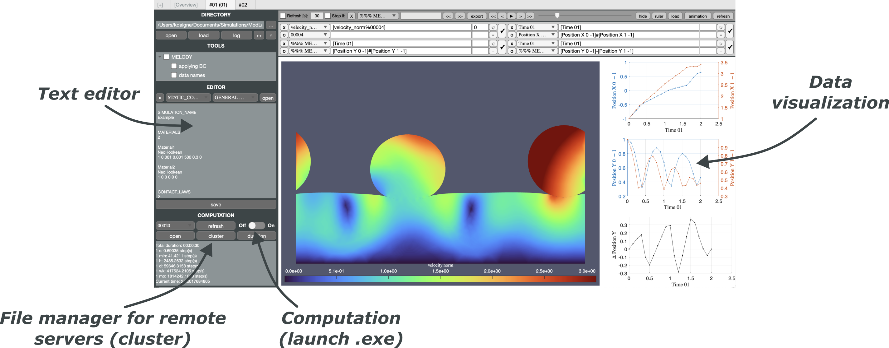
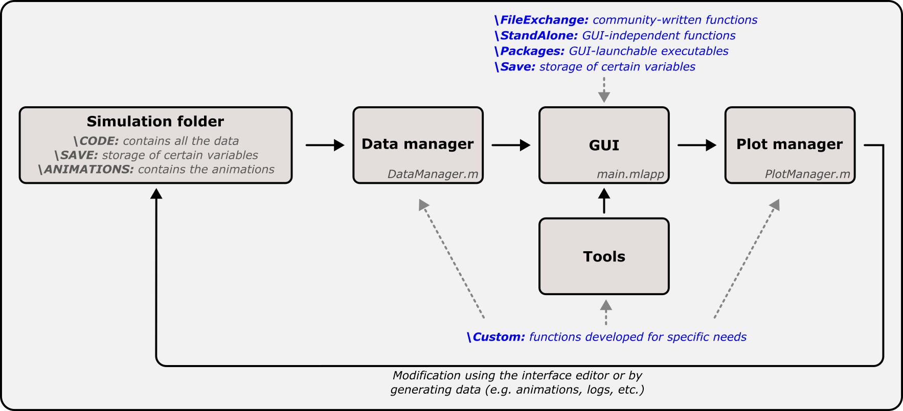

# Overview

ModLab is a graphical user interface (GUI) developed in MATLAB (and some additional features using shell and batch scripts). It groups together several functionalities needed to manage simulations (text editor, local and remote command prompts, data viewer, etc.). This simplifies simulation processing and enables the different modules to interact with each other.

# Prerequisites

The following components are required:
- MATLAB R2024a (with App Designer)
- Toolbox: Image Processing Toolbox
- Toolbox: Statistics and Machine Learning Toolbox

An older version of MATLAB may work, but some features will be inaccessible, leading to errors. To start the GUI, double-click on ModLab.lnk (the shortcut in the main folder). If it does not work (e.g. for macOS), double-click on \Functions\Management\main.mlapp. To transfer data to a remote server, see user guide.

See example_simu_to_select (file must be unzipped) for a simulation example.

# Structure

The GUI is made up of several interconnected blocks, as shown below:

The main purpose of this structure is to bring all the complexity into a single function (main.mlapp) that acts like a black box (which should not be modified except in very specific cases). Thanks to this, the user has almost complete control over processing, by playing with a few inputs and outputs. The main blocks are described below:

- Simulation folder: contains all simulation files and others. Data files (model inputs, graphical outputs, etc.) are contained in the \CODE subfolder. Only simulation files in this folder can be read. The GUI performs a number of operations, some of which can be stored in the \SAVE subfolder. These two subfolders are the main ones, and others can be created according to specific operations (\ANIMATIONS, \PREPROCESSING, etc.).

- Data manager: function to define custom data that can be used within the GUI. This may correspond, for example, to a material parameter contained in a specific file, or to a graphical output on which particular processing is performed.

- GUI: function which contains almost all the code defining the GUI. In particular, it includes the definition of objects and their interactions. It uses the MATLAB app designer tool.

- Plot manager: all data displayed in the GUI use this function. This provides an easy way of modifying certain properties or data in the graph before it is even created. Combined with the data manager, customized graphs can be defined and displayed directly in two clicks within the GUI.

- Tools: user-developed tools, which can interact with all blocks. This provides a simple way of creating functions for specific needs, easily accessible from the GUI, and particularly versatile.

There are several subfolders containing functions used by the GUI. In particular, \Custom stores all custom functions developed by the user, which can then be called from the data manager, GUI, plot manager and tools.
